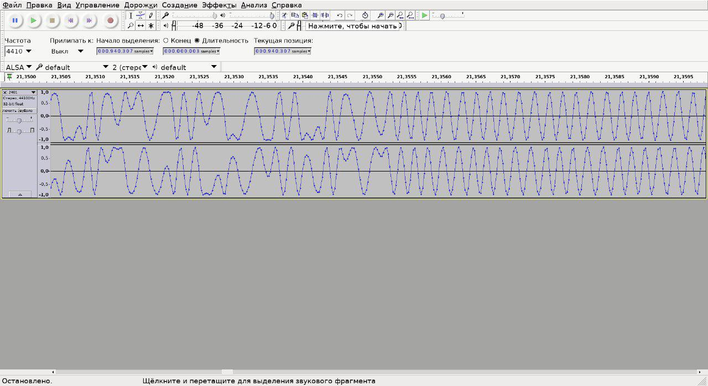
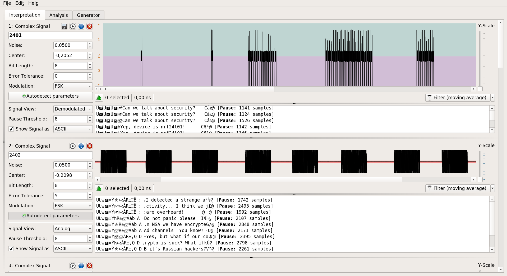
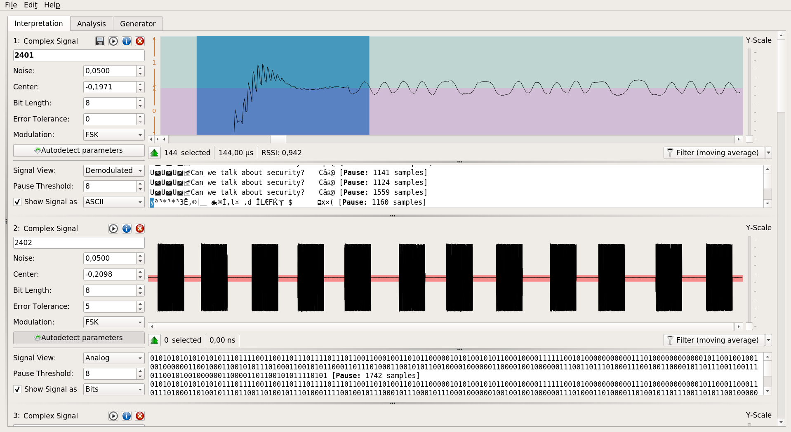

# Hackquest 2017 day 5 task writeup

We are big fans of GSM security aspects and radio in common, it was a great pleasure to see this kind of task.

## Radio 

Since Task's description asks us to connect via `nc`, then we don't have choice except as to do it.
```bash
nc 35.195.97.218 31337 | head -c 300
Hey you're entering into secure zone. Enter Password: 
```

It was so kind to see the password `antiNSAradiospy` in the description. Pretty easy.

Then we got some options to choose radio frequency in range `[2401, 2402, 2403, 2404, 2405, 2406, 2407, 2408, 2409, 2410, 2411]`. According to the description we got `I/Q`-data, for people who are not working with radio signals it is known as simple radio raw data.

Consider the first frequency signals.

```
00000000: 4865 7920 796f 7527 7265 2065 6e74 6572  Hey you're enter
00000010: 696e 6720 696e 746f 2073 6563 7572 6520  ing into secure 
00000020: 7a6f 6e65 2e20 456e 7465 7220 5061 7373  zone. Enter Pass
00000030: 776f 7264 3a20 0a48 656c 6c6f 2120 5468  word: .Hello! Th
00000040: 6973 2069 7320 4e53 415f 7375 7033 725f  is is NSA_sup3r_
00000050: 7234 6431 6f5f 6834 636b 316e 675f 7370  r4d1o_h4ck1ng_sp
00000060: 795f 6433 7631 6333 2e20 5365 6c65 6374  y_d3v1c3. Select
00000070: 2066 7265 7175 656e 6379 2e20 4176 6169   frequency. Avai
00000080: 6c61 626c 6520 6672 6571 7565 6e63 6965  lable frequencie
00000090: 7320 284d 487a 2920 6973 3a20 3234 3031  s (MHz) is: 2401
000000a0: 2c20 3234 3032 2c20 3234 3033 2c20 3234  , 2402, 2403, 24
000000b0: 3034 2c20 3234 3035 2c20 3234 3036 2c20  04, 2405, 2406, 
000000c0: 3234 3037 2c20 3234 3038 2c20 3234 3039  2407, 2408, 2409
000000d0: 2c20 3234 3130 2c20 0a53 7461 7274 696e  , 2410, .Startin
000000e0: 6720 7472 616e 736d 6973 7369 6f6e 210a  g transmission!.
000000f0: 0000 703c 0000 8c3c 0000 703c 0000 883c  ..p<...<..p<...<
00000100: 0000 683c 0000 903c 0000 503c 0000 883c  ..h<...<..P<...<
00000110: 0000 703c 0000 943c 0000 583c 0000 8c3c  ..p<...<..X<...<
00000120: 0000 583c 0000 883c 0000 783c 0000 903c  ..X<...<..x<...<
00000130: 0000 603c 0000 943c 0000 703c 0000 883c  ..`<...<..p<...<
00000140: 0000 703c 0000 943c 0000 683c 0000 943c  ..p<...<..h<...<
00000150: 0000 683c 0000 903c 0000 683c 0000 943c  ..h<...<..h<...<
00000160: 0000 683c 0000 843c 0000 583c 0000 8c3c  ..h<...<..X<...<
00000170: 0000 683c 0000 903c 0000 703c 0000 883c  ..h<...<..p<...<
00000180: 0000 603c 0000 843c 0000 603c 0000 943c  ..`<...<..`<...<
00000190: 0000 783c 0000 943c 0000 603c 0000 8c3c  ..x<...<..`<...<
000001a0: 0000 683c 0000 943c 0000 683c 0000 8c3c  ..h<...<..h<...<
000001b0: 0000 683c 0000 903c 0000 603c 0000 903c  ..h<...<..`<...<
000001c0: 0000 783c 0000 883c 0000 703c 0000 903c  ..x<...<..p<...<
000001d0: 0000 583c 0000 8c3c 0000 683c 0000 903c  ..X<...<..h<...<
000001e0: 0000 683c 0000 903c 0000 683c 0000 8c3c  ..h<...<..h<...<
000001f0: 0000 783c 0000 8c3c 0000 583c 0000 843c  ..x<...<..X<...<
00000200: 0000 683c 0000 903c 0000 783c 0000 903c  ..h<...<..x<...<
00000210: 0000 683c 0000 8c3c 0000 703c 0000 8c3c  ..h<...<..p<...<
00000220: 0000 783c 0000 903c 0000 683c 0000 943c  ..x<...<..h<...<
00000230: 0000 603c 0000 883c 0000 783c 0000 8c3c  ..`<...<..x<...<
00000240: 0000 703c 0000 903c 0000 703c 0000 903c  ..p<...<..p<...<
00000250: 0000 683c 0000 903c 0000 603c 0000 9c3c  ..h<...<..`<...<
00000260: 0000 783c 0000 903c 0000 703c 0000 943c  ..x<...<..p<...<
00000270: 0000 703c 0000 8c3c 0000 703c 0000 903c  ..p<...<..p<...<
00000280: 0000 703c 0000 803c 0000 683c 0000 903c  ..p<...<..h<...<
00000290: 0000 683c 0000 903c 0000 783c 0000 903c  ..h<...<..x<...<
000002a0: 0000 583c 0000 883c 0000 703c 0000 8c3c  ..X<...<..p<...<
000002b0: 0000 703c 0000 8c3c 0000 703c 0000 903c  ..p<...<..p<...<
```

The first thing we need to guess is `sample`-format. Assume it's `float` sample, it was a good choice :). To check this we need to open this raw data by any `sample`-reader, e.g [dusty](http://www.audacityteam.org/download/), therefore we got next picture.



To be sure we are right the picture must be looked as some kind of smooth signal, e.g sinusoidal. Seems like we guessed. You could try others samples and in most of cases there will be irregular signals. And now we are stuck, because we don't know any other parameters, e. g. sample rate and modulation. And we need some strong tools such as `gnuradio`, `bauline` and 'urh'. Yeas, we took them from the hint. We spend a lot of time on gnuradio, because it's popular and well supported, but it's too complicated to solve task in 24 hours. Well, `urh`, hm, just first time listen about it. Let's try!

Instead of `gnuradio` it involves pretty simple gnu and provides to analyze each signal parameter very easy. And we started to play wich such parameteres. Now the main task is to guess how much samples encode 1 bit! The `nrf` set `bit length` is equal to 100, but it looks wrong. We must to fix this parameter. By 100 samples phase shifts more than ones. We hope to find some printable text, there is why we need to find such `samples per bit` that provides one phase changing per one bit. 

After a few tries we noticed that 8 bit length generates ascii text, which presented on picture below.



Because of noise in the beginning of each burst most of texts is broken. Now we need clear this noise by hands. Yeas, we could write a script, but in the race to solve the task we didn't choose this way. After a few cuts we are able to see the text on every channel. Need to notice that on every channel text transmits repeately. 



Now we got all texts. Let's read it. On channel `2405` we found a link to protocol and channel [description](https://pastebin.com/EF0TK9e0). On channel `2406` two NSA agents decided to create an encrypted channel. 

~~~~
UìÙÚ   í öl% u  Steve, I'm confused wi¿z@ [Pause: 1221 samples]
UìÙÚ   í öl% u ,th all these keys for 4$@ [Pause: 2009 samples]
UìÙÚ   í öl% u BRSA. Is this is the onæÖ@ [Pause: 2035 samples]
UìÙÚ   í öl% u Xe that I should use? h¦å@ [Pause: 1467 samples]
UìÙÚ   í öl% u nttps://pastebin.com/Di¸_@ [Pause: 2040 samples]
UìÙÚ   í öl% u u7LyG7Q?               ~l@ [Pause: 1947 samples]
UìÙÚ  ölí  Õ ß  Dave, you are doing it¿(@ [Pause: 1395 samples]
UìÙÚ  ölí  Õ ß , wrong! This channel içþ@ [Pause: 2034 samples]
UìÙÚ  ölí  Õ ß Bs only for encrypted mTd@ [Pause: 2157 samples]
UìÙÚ  ölí  Õ ß Xessages! Please genera @ [Pause: 2315 samples]
UìÙÚ  ölí  Õ ß nte new RSA key pair. T¬ü@ [Pause: 2964 samples]
UìÙÚ  ölí  Õ ß o understand how this ¶@ [Pause: 3488 samples]
UìÙÚ  ölí  Õ ß thing works send me anm@ [Pause: 3031 samples]
UìÙÚ  ölí  Õ ß ° encrypted message usiÇf@ [Pause: 2673 samples]
UìÙÚ  ölí  Õ ß Æng my public key: httpÌD@ [Pause: 2670 samples]
UìÙÚ  ölí  Õ ß Üs://pastebin.com/eRFbC /@ [Pause: 2397 samples]
UìÙÚ  ölí  Õ ß ß3BE                   vì@ [Pause: 4173 samples]
UìÙÚ  í öl¥ Q  Ok Steve, catch encryp¯ä@ [Pause: 4353 samples]
UìÙÚ  í öl¥ Q ,ted data in next messa M@ [Pause: 3875 samples]
UìÙÚ  í öl¥ Q Bge. I will repeat dataB)@ [Pause: 3277 samples]
UìÙÚ  í öl¥ Q Q several times.       µ@ [Pause: 30223 samples]
UìÙÚ  í öllh @  JΤ#û¼êU¢Ä FÕq,g Ù ÛÈ@ [Pause: 2653 samples]
UìÙÚ  í öllh @ ,¥%ï  Âo ñ ù»¦Ìùº­ ã K j@ [Pause: 3158 samples]
UìÙÚ  í öllh @ @E APause: 3671 samples]
~~~~

## Crypto

Well, now we got [private](https://pastebin.com/Di7LyG7Q) and [public](https://pastebin.com/eRFbC3BE) which are not paired! But Dave has showed his private key and has encrypted the message via Steve's public key. Let's investigate all keys.

```
$ openssl rsa -in priv.key -noout -t
Private-Key: (511 bit)
modulus:
    70:2b:a6:a1:20:93:e8:cf:cc:3c:fe:ca:c2:3c:cc:
    4f:ef:48:10:a5:83:85:bf:e0:f9:d8:34:98:e1:70:
    9d:97:ee:be:9a:f6:6c:b0:b8:77:6a:35:12:3d:a2:
    1b:8f:cb:d1:a2:53:ac:dd:be:91:03:16:3a:44:6a:
    07:7b:8c:67
publicExponent:
    36:38:82:5d:1c:fd:11:6a:57:48:72:be:23:6b:bb:
    31:0d:da:cb:90:f6:22:fe:50:49:77:21:67:5f:33:
    79:8d:a3:de:9a:cd:62:b5:1e:97:8d:d7:1c:f6:c9:
    cd:85:f3:60:5e:73:ad:11:e7:1f:9f:54:91:8f:22:
    5d:86:d0:3f
privateExponent:
    23:fb:fa:2b:08:bc:d7:4d:70:b7:4b:12:59:d8:94:
    89:fb:00:06:20:6d:4c:1a:0c:57:ff:2c:91:18:b4:
    11:89:88:09:7c:2f:70:43:f0:98:53:76:26:e7:23:
    34:90:58:a0:ed:8f:1c:7d:ec:43:ae:44:e7:78:3e:
    08:f4:80:ff
prime1:
    00:d0:e7:1b:6f:3b:92:90:58:8f:1b:59:2f:88:7e:
    f8:5c:53:a6:30:d8:aa:40:73:90:5a:ec:35:7a:83:
    b1:bb:17
prime2:
    00:89:75:9c:07:a2:c4:a5:5a:db:de:97:f3:8f:f4:
    92:20:97:20:5f:de:52:cb:9c:48:f8:9d:45:58:60:
    f1:4b:31
exponent1:
    37:8c:03:77:3e:11:02:97:7d:94:30:32:ba:f7:4e:
    fe:92:ef:16:14:35:c1:ba:e5:ee:72:c4:69:95:84:
    06:43
exponent2:
    00:93:a7:92:86:36:39:61:1f:2e:7f:e4:e7:e8:fa:
    53:40:96:1d:d6:77:47:8d:59:67:61:14:c9:9a:32:
    e3:66:f3
coefficient:
    00:89:3b:65:56:3b:e5:23:77:ff:19:28:20:65:8c:
    db:c6:9e:b0:5b:9c:5a:d2:88:9e:6a:74:12:86:e5:
    bd:33:87

$ openssl rsa -pubin -noout -text
-----BEGIN PUBLIC KEY-----
MIGaMA0GCSqGSIb3DQEBAQUAA4GIADCBhAJAcCumoSCT6M/MPP7KwjzMT+9IEKWD
hb/g+dg0mOFwnZfuvpr2bLC4d2o1Ej2iG4/L0aJTrN2+kQMWOkRqB3uMZwJAQui2
EbKYnqOAk6/dWzJPBUFeAX7Jl5rMj0QLCjAf51JdiX1A9DtKN27fH0MQ1X7zMvHm
4RojILm9moV9ut+S1w==
-----END PUBLIC KEY-----
Public-Key: (511 bit)
Modulus:
    70:2b:a6:a1:20:93:e8:cf:cc:3c:fe:ca:c2:3c:cc:
    4f:ef:48:10:a5:83:85:bf:e0:f9:d8:34:98:e1:70:
    9d:97:ee:be:9a:f6:6c:b0:b8:77:6a:35:12:3d:a2:
    1b:8f:cb:d1:a2:53:ac:dd:be:91:03:16:3a:44:6a:
    07:7b:8c:67
Exponent:
    42:e8:b6:11:b2:98:9e:a3:80:93:af:dd:5b:32:4f:
    05:41:5e:01:7e:c9:97:9a:cc:8f:44:0b:0a:30:1f:
    e7:52:5d:89:7d:40:f4:3b:4a:37:6e:df:1f:43:10:
    d5:7e:f3:32:f1:e6:e1:1a:23:20:b9:bd:9a:85:7d:
    ba:df:92:d7
``` 

Here we noticed equal modulus in each key, that means we could factorize modulus (just copy Prime1 = p and Prime2 = q from private key). We could easy restore `d` via Prime1 and Prime2, because we know Euler's function (p - 1) * (q - 1).
Then we crafted Steve's private key and decrypted the message.

```
>>> n = 5874846371433782042937824062408828985124575246873309374196976922993783700482514263214487596542175968469264262899319103460235578045136747009030119157894247L
>>> e = 3504310149508862240435696471263221237316584424511091937000136464097505584194416226220682717837433083194509510410903414354602361559303622900158033416917719L
>>> d = 4538648915854388211234540417161289252275500091141222319032672425673169822257260179167723520509378727407182924655191246085357405296148645069316623846611719L
>>> p = 94489403523262377040487838285070401786602935364398580685213134614587665136407L
>>> q = 62174658240777778860434621000148846716157431607597179215305629229457616227121L
>>> key = RSA.construct(n,e,d,p,q)
Traceback (most recent call last):
  File "<stdin>", line 1, in <module>
TypeError: construct() takes exactly 2 arguments (6 given)
>>> key = RSA.construct((n,e,d,p,q))
>>> key
<_RSAobj @0x34fd440 n(511),e,d,p,q,u,private>
>>> from binascii import unhexlify
>>> ct = unhexlify('4acea423fbbc878fea55a2c41a9646d5712c670cd910a525ef061cc26f02f10ff9bba6ccf9baad0e99e3064b4512413c0b34e5933d6186f65d4fcda19a7e7a54')
>>> key.decrypt(ct)
'flag{stup1d_ns4_h4ck1ng_dev1ce_zn2017}'
```
